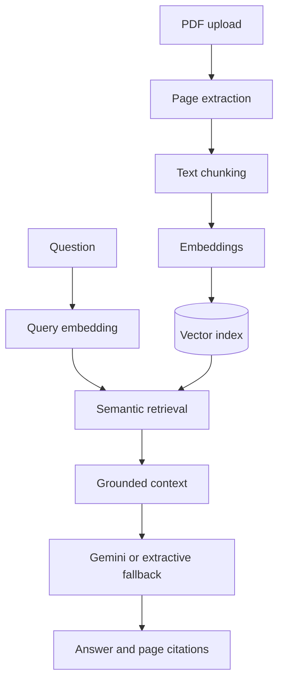

# 📚 RAGSource

[](https://github.com/engdareenbassamesleem/ragsource/actions/workflows/ci.yml)

> A citation-first RAG knowledge assistant for PDF documents, built with Python and FastAPI.

RAGSource turns a collection of PDFs into a searchable knowledge base. It extracts page-level
text, creates overlapping chunks, generates semantic embeddings, retrieves the most relevant
evidence, and produces an answer with traceable source markers.

The project is designed as a portfolio-ready demonstration of practical AI engineering:
retrieval, grounding, citation metadata, provider abstraction, API design, persistence, tests,
and containerization.

## Why this project?

Generic chatbots can answer fluently without showing where their claims came from. RAGSource
uses a citation-first pipeline: every retrieved passage retains its document name and PDF page,
and the generator is instructed to answer only from that context.

## Features

- PDF upload and page-aware text extraction
- Overlapping, sentence-aware text chunking
- Semantic search using FastEmbed and a compact BGE embedding model
- Cosine-similarity retrieval with a configurable confidence threshold
- Gemini generation when an API key is configured
- Safe extractive fallback without an external LLM
- Source objects containing filename, page, score, and excerpt
- Duplicate-safe document IDs based on content hashes
- Persistent local JSON vector index with atomic writes
- FastAPI endpoints and automatic OpenAPI documentation
- Dependency injection for isolated tests
- Docker and Docker Compose support

## Architecture



## API

| Method | Endpoint | Purpose |
|---|---|---|
| `GET` | `/health` | Service health and indexed chunk count |
| `POST` | `/v1/documents` | Upload and index a PDF |
| `POST` | `/v1/ask` | Ask a question against indexed documents |
| `GET` | `/docs` | Interactive Swagger documentation |

### Upload a PDF

```bash
curl -X POST http://localhost:8000/v1/documents \
  -F "file=@handbook.pdf;type=application/pdf"
```

### Ask a question

```bash
curl -X POST http://localhost:8000/v1/ask \
  -H "Content-Type: application/json" \
  -d '{"question":"What is the refund policy?","top_k":5}'
```

Example response:

```json
{
  "answer": "The refund request must be submitted within the stated period [S1].",
  "sources": [
    {
      "citation": "S1",
      "document_id": "e3b0c44298fc1c14",
      "filename": "handbook.pdf",
      "page": 8,
      "score": 0.8124,
      "excerpt": "Refund requests must be submitted..."
    }
  ],
  "grounded": true
}
```

## Run locally

Requirements: Python 3.11+.

```bash
git clone https://github.com/engdareenbassamesleem/ragsource.git
cd ragsource
python -m venv .venv
source .venv/bin/activate  # Windows: .venv\\Scripts\\activate
python -m pip install -e ".[dev]"
cp .env.example .env
uvicorn ragsource.api:app --reload
```

Open `http://localhost:8000/docs`.

The first start downloads the configured embedding model. Add a Gemini API key to
`.env` for generated answers. If no key is supplied, the API returns the retrieved passages as
a transparent extractive response.

## Run with Docker

```bash
cp .env.example .env
docker compose up --build
```

## Quality checks

```bash
pytest
ruff check .
ruff format --check .
```

The tests use deterministic fakes, so they do not require a model download or external API key.

## Project structure

```text
ragsource/
├── src/ragsource/
│   ├── api.py          # FastAPI routes and dependency container
│   ├── chunking.py     # Text cleanup and overlapping chunks
│   ├── config.py       # Environment-driven settings
│   ├── embeddings.py   # Embedding provider and similarity search
│   ├── ingestion.py    # PDF ingestion pipeline
│   ├── llm.py          # Gemini and extractive generators
│   ├── models.py       # Request, response, and domain models
│   ├── service.py      # Retrieval-augmented generation orchestration
│   └── store.py        # Persistent vector index
├── tests/
├── Dockerfile
├── docker-compose.yml
└── pyproject.toml
```

## Engineering decisions

- **Page-level provenance:** chunks never lose the PDF page that produced them.
- **Grounding threshold:** weak retrieval results produce an explicit refusal rather than a guess.
- **Provider boundaries:** embedding and generation interfaces can be replaced independently.
- **Atomic persistence:** the index is written to a temporary file before replacement.
- **Testability:** the API container can be overridden without loading an embedding model.

## MVP limitations

- The JSON vector store is intended for a focused portfolio MVP, not a large multi-tenant corpus.
- Image-only scanned PDFs require OCR before ingestion.
- PDF content is treated as untrusted evidence; production deployments should add stronger prompt-
  injection defenses, authentication, rate limiting, and file malware scanning.
- Generated answers still require user review in high-stakes settings.

## Roadmap

- Hybrid dense and keyword retrieval
- Reranking and evaluation datasets
- PostgreSQL with pgvector
- Streaming responses
- Authentication and per-user collections
- OCR for scanned PDFs
- RAG quality metrics and tracing

## Author

**Dareen Esleem** — AI Engineer focused on AI-powered applications and automation systems.

- [GitHub](https://github.com/engdareenbassamesleem)
- [LinkedIn](https://www.linkedin.com/in/dareenesleem2001/)

## License

MIT
